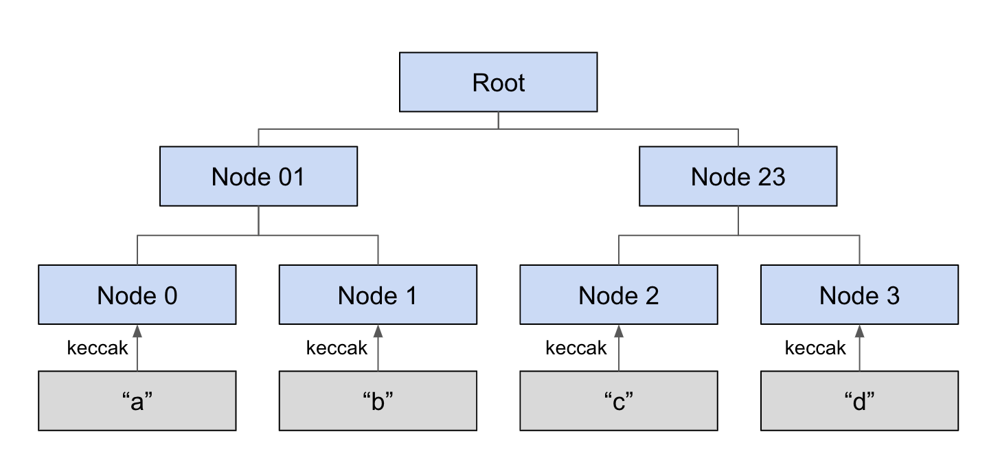
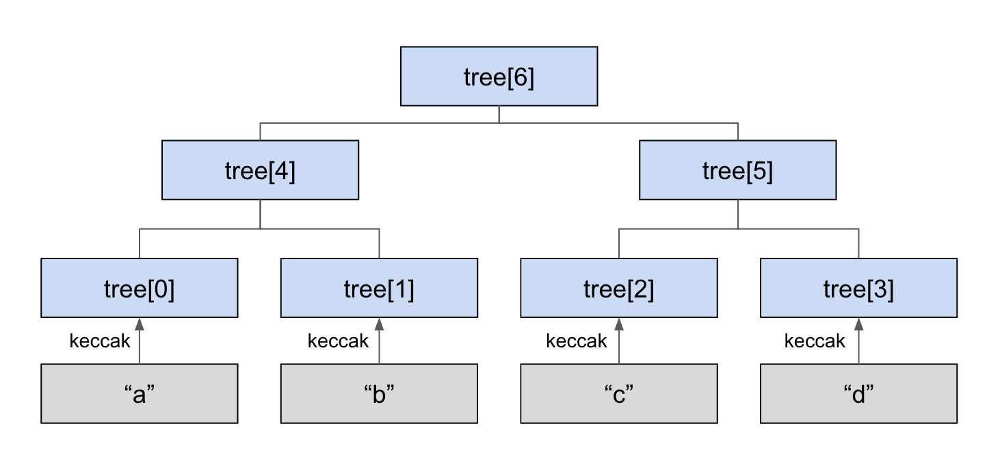
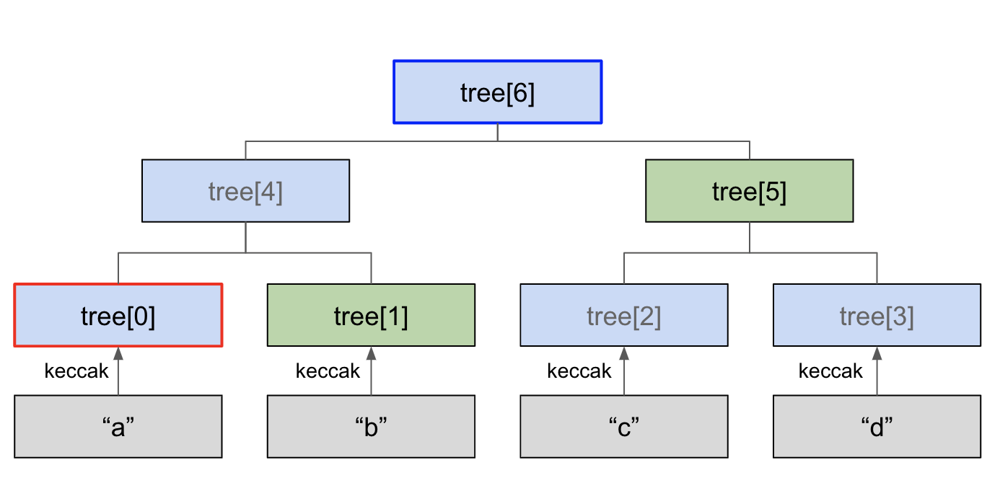

# Merkle tree 생성하고 검증하는 법

## MerkleTree


이번 예제에서는 아래 그림과 같은 머클 트리를 다룰 것입니다.





1. Merkle tree 생성하기
    
    
    `contracts/MerkleTree.sol`의 constructor에서 머클트리를 생성합니다. `bytes32[] tree` 배열에 raw data의 keccak256 해시함수 값을 leaf node로 저정합니다. 이후 내부함수 `hashing`을 사용하여 parent node를 계산해나가고 최종적으로 merkle root까지 계산하여 `bytes32[] tree`에 append 합니다.


    ```
    tree.push(keccak256('a')); // tree[0]
    tree.push(keccak256('b')); // tree[1]
    tree.push(keccak256('c')); // tree[2]
    tree.push(keccak256('d')); // tree[3]

    // [NOTE] hashing(left_node, right_node) returns their parents node value.

    // Calculate a + b
    tree.push(hashing(tree[0], tree[1])); // tree[4] -> a + b

    // Calculte c + d
    tree.push(hashing(tree[2], tree[3])); // tree[5] -> c + d 

    // Calculate a + b + c + d -> root
    tree.push(hashing(tree[4], tree[5]));
    ```


    아래는 내부함수 hashing 입니다.
    ```
    function hashing(bytes32 left, bytes32 right) private pure returns (bytes32) {
        if (left <= right) {
            return keccak256(abi.encodePacked(left, right));
        } else {
            return keccak256(abi.encodePacked(right, left));
        }
    }
    ```


    정리하면 `bytes32[] tree`의 각각 원소의 값은 아래 그림과 같은 의미를 가집니다.


    


2. Merkle proof 검증하기


    머클트리에서 데이터 무결성을 왜 검증할까요? 간단히 배경을 말하자면, 풀노드로부터 받은 데이터가 블럭에 반영된 무결한 데이터인지를 판단하기 위해서 입니다. 이때 풀노드에게 요구한 데이터와 이를 증명할 수 있는 머클증명을 전달받고 이를 통해 머클루트 값을 재구성하여 실제 블럭에 반영된 머클루트 값과 비교하여 데이터의 무결성을 검증합니다.


    만약 "a"가 실제 해당 머클트리에 존재하는지 알기 위해서는 머클루트와 머클증명이 필요합니다. 여기서 머클증명은 쉽게 말해 검증하고 싶은 데이터 "a"와 함께  머클루트를 계산해낼 수 있는 값들입니다. 아래 그림을 보면서 차근차근 더 알아봅시다.


    위 예시에서는 "a"의 머클트리 포함 여부를 알려고 합니다. 따라서 leaf node는 "a"의 keccak256 해시함수 값인 `tree[0]`이고, 당연하게도 머클루트 값은 `tree[6]` 입니다. 이때 우리가 필요한 값은 `tree[1]`과 `tree[5]`입니다. 이 두 값이 추가적으로 머클증명으로 주어진다면 우리는 머클루트를 직접 계산해서 주어진 머클루트와 비교하여 "a"가 실제 머클트리에 포함된 데이터인지 판단합니다. 아래 그림에서 초록색 노드의 값인 `tree[1]`와 leaf node `tree[0]`를 합친 후 해시함수를 돌린 결과가 곧 `tree[4]`가 될 것이고 이 값은 `tree[5]`와 합쳐 해시함수를 다시 수행하면 최종적으로 머클루트인 `tree[6]`을 재구성할 수 있습니다. 이때, 실제 블럭에 포함된 머클루트 값이 재구성한 머클루트 값과 동일할 때 머클 증명을 성공한 것입니다. 지금까지의 내용이 헷갈린다면, 머클트리를 어떻게 만들어갔는지를 차분히 떠올려보면 이해가 되실겁니다. 


    
    

    ```
    root = tree[6]; // Merkle root: a + b + c + d 
    leaf = tree[0]; // Leaf node you want to verify: a
    
    // Generate the merkle proof
    proof.push(tree[1]); // b
    proof.push(tree[5]); // c + d
    ```


    위 코드는 `contracts/MerkleTree.sol`에서 머클루트, 머클증명, 무결성을 판단하고 싶은 leaf node에 값을 할당합니다. 아래 코드는 Openzeppelin 라이브러리 코드이고 `node_modules/@openzeppelin/contracts/cryptography/MerkleProof.sol`에 위치합니다. 이 함수에 위에서 정의한 `root`, `leaf`, `proof`를 전달하면 이를 통해 머클루트를 재구성하고 실제 `root`값과 동일한지 여부를 통해 Boolean을 반환합니다. 반환값이 `true`이면 머클증명을 검증한 것입니다.

    
    ```
        function verify(bytes32[] memory proof, bytes32 root, bytes32 leaf) internal pure returns (bool) {
        bytes32 computedHash = leaf;

        for (uint256 i = 0; i < proof.length; i++) {
            bytes32 proofElement = proof[i];

            if (computedHash <= proofElement) {
                // Hash(current computed hash + current element of the proof)
                computedHash = keccak256(abi.encodePacked(computedHash, proofElement));
            } else {
                // Hash(current element of the proof + current computed hash)
                computedHash = keccak256(abi.encodePacked(proofElement, computedHash));
            }
        }

        // Check if the computed hash (root) is equal to the provided root
        return computedHash == root;
    }
    ```

## Compile


```
$ truffle compile

Compiling your contracts...
===========================
> Compiling ./contracts/MerkleTree.sol
> Artifacts written to /Users/username/Workspace/basic-blockchain-programming/build/contracts
> Compiled successfully using:
   - solc: 0.6.11+commit.5ef660b1.Emscripten.clang
```


위의 명령어를 통해 코드를 컴파일 할 수 있습니다. Truffle은 *contracts* 디렉토리 아래 모든 `.sol` 파일을 컴파일 하는 것을 알 수 있습니다.


## Depoly


compile 명령어와 마찬가지로 `truffle migrate`도 *migrations* 디렉토리 아래 모든 `.js` 파일을 통해 스마트 컨트랙트를 배포하는 것을 알 수 있습니다. 여기서 배포한다는 의미는 쉽게 말해 작성한 코드를 이더리움 네트워크에 전송하여 저장한다는 의미로 이해해도 좋을 것 같습니다.

```
$ truffle migrate


Compiling your contracts...
===========================
> Compiling ./contracts/MerkleTree.sol
> Artifacts written to /Users/username/Workspace/basic-blockchain-programming/build/contracts
> Compiled successfully using:
   - solc: 0.6.11+commit.5ef660b1.Emscripten.clang


Starting migrations...
======================
> Network name:    'development'
> Network id:      1606043634322
> Block gas limit: 6721975 (0x6691b7)


1_deploy_myfirstcontract.js
===========================

   Replacing 'MyFirstContract'
   ---------------------------
   > transaction hash:    0x3e2bb158a5820ebeb7e7d4f78cf9b6352599b03cb51395ba46b05b787857a30d
   > Blocks: 0            Seconds: 0
   > contract address:    0x8e06b0749cB09437bA6670552CE882724e7Ea1c2
   > block number:        50
   > block timestamp:     1606137432
   > account:             0xbD79CD192ee3de491c493a35012878B4Beea3327
   > balance:             99.41327496
   > gas used:            115009 (0x1c141)
   > gas price:           20 gwei
   > value sent:          0 ETH
   > total cost:          0.00230018 ETH

   > Saving artifacts
   -------------------------------------
   > Total cost:          0.00230018 ETH


2_deploy_merkletree.js
======================

   Replacing 'MerkleTree'
   ----------------------
   > transaction hash:    0x6857c7ddd9e8b38ef9a6315bff0b00c5c0894e133d2a1d6e6fe3f2281a0c928c
   > Blocks: 0            Seconds: 0
   > contract address:    0x7b3D66b8b711603B08903204d6E9828aB17a3bDF
   > block number:        51
   > block timestamp:     1606137433
   > account:             0xbD79CD192ee3de491c493a35012878B4Beea3327
   > balance:             99.40427012
   > gas used:            450242 (0x6dec2)
   > gas price:           20 gwei
   > value sent:          0 ETH
   > total cost:          0.00900484 ETH

   > Saving artifacts
   -------------------------------------
   > Total cost:          0.00900484 ETH


3_deploy_mytoken.js
===================

   Replacing 'MyToken'
   -------------------
   > transaction hash:    0x3b8e23f3d543f1abe23ad808653f4830cce18f46bcf1c7fe105ad1525a79bf77
   > Blocks: 0            Seconds: 0
   > contract address:    0x5633C8927F6B1a1D7FE4Adc28E927dA48897b08b
   > block number:        52
   > block timestamp:     1606137433
   > account:             0xbD79CD192ee3de491c493a35012878B4Beea3327
   > balance:             99.3817017
   > gas used:            1128421 (0x1137e5)
   > gas price:           20 gwei
   > value sent:          0 ETH
   > total cost:          0.02256842 ETH

   > Saving artifacts
   -------------------------------------
   > Total cost:          0.02256842 ETH


Summary
=======
> Total deployments:   3
> Final cost:          0.03387344 ETH

## Test
contract('MyFirstContract', () => {
    before(async () => {
        myfirstcontract = await MyFirstContract.new(); // Deploy new MyFirstContract contract before testing.
    })

    it('Should deploy a smart contract properly', async () => {
        // console.log(myfirstcontract.address);
        assert(myfirstcontract.address != ''); // The deployed contract's address should not be null.
    })

    it('Should return hello world', async () => {
        const result = await myfirstcontract.printHelloWorld();
        console.log(result);
        assert(result === 'Hello World!'); // The return string of getStr() should be "Hello World".

    })
})
```


## Test


```
describe('Should be verified', function() {
    it(' ', async function() {
        const result = await this.merkletree.doVerify();
        // console.log(result);
        assert(result == true); // The merkle proof should be verified.
    });
});
```


위 코드는 `test/merkletree_test.js`의 일부분입니다. 이 코드를 통해 배포한 `MerkleTree` 스마트 컨트랙트의 `doVerify()` 함수를 호출하여 반환값을 `result`에 저장합니다. assert문을 통해서 반환값이 `true`이면 테스트 통과, 즉 머클증명에 성공한 것입니다.


```
$ truffle test test/merkletree_test.js
Using network 'development'.


Compiling your contracts...
===========================
> Compiling ./contracts/MerkleTree.sol
> Artifacts written to /var/folders/wj/_8d_tlzs7jl_c_qtv72j7rs40000gn/T/test--87080-pmlBJsWJ6py2
> Compiled successfully using:
   - solc: 0.6.11+commit.5ef660b1.Emscripten.clang


  Contract: MerkleTree
    Should be verified
      ✓  


  1 passing (336ms)
```