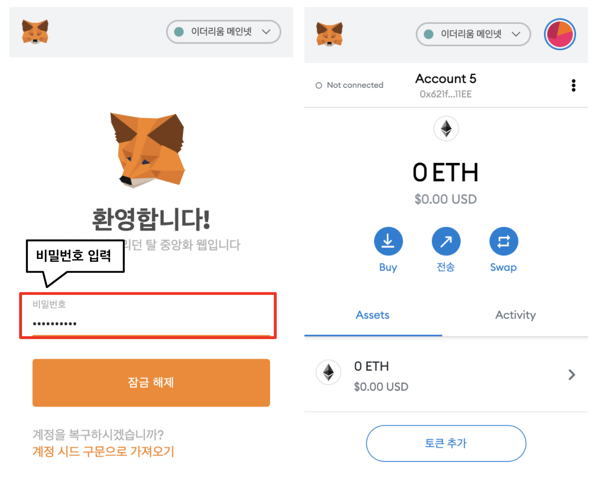
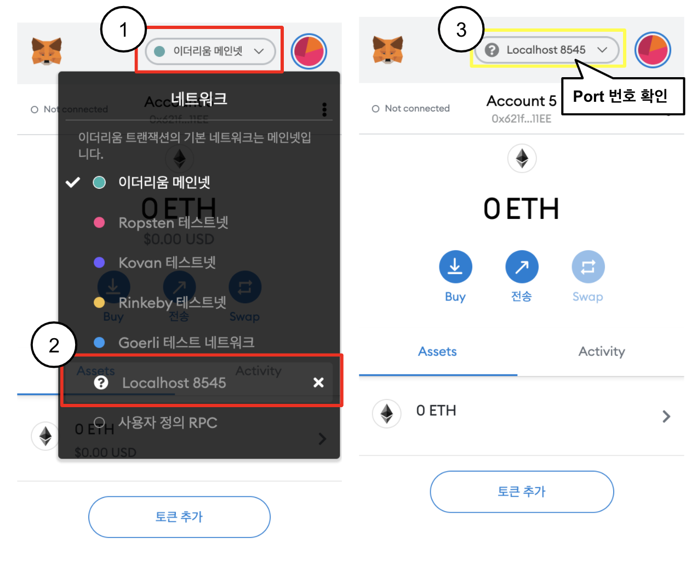
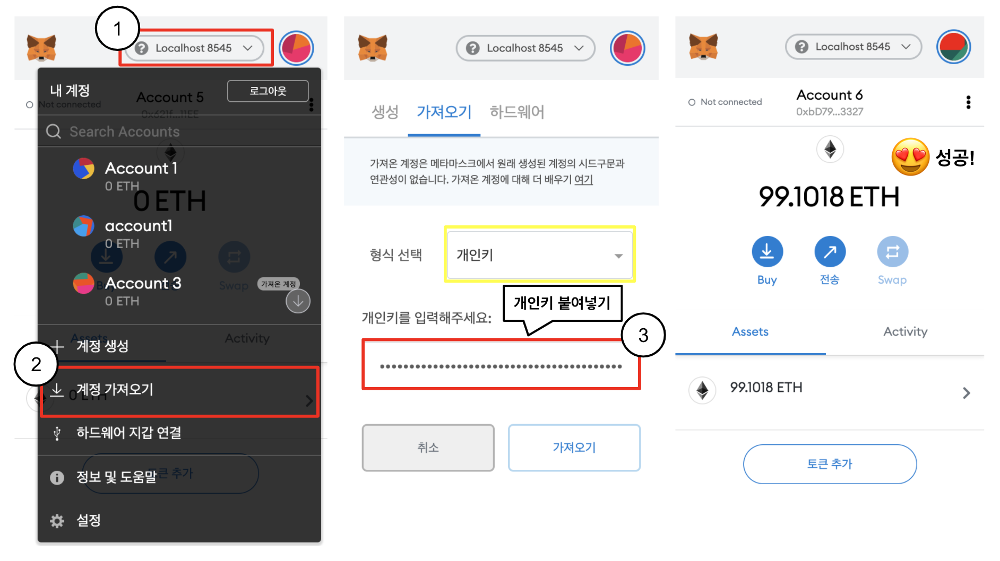
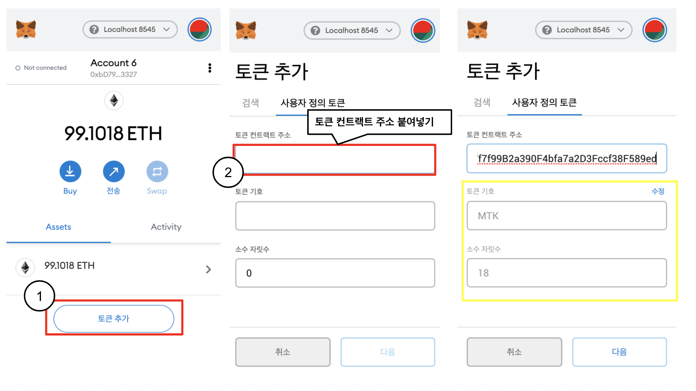
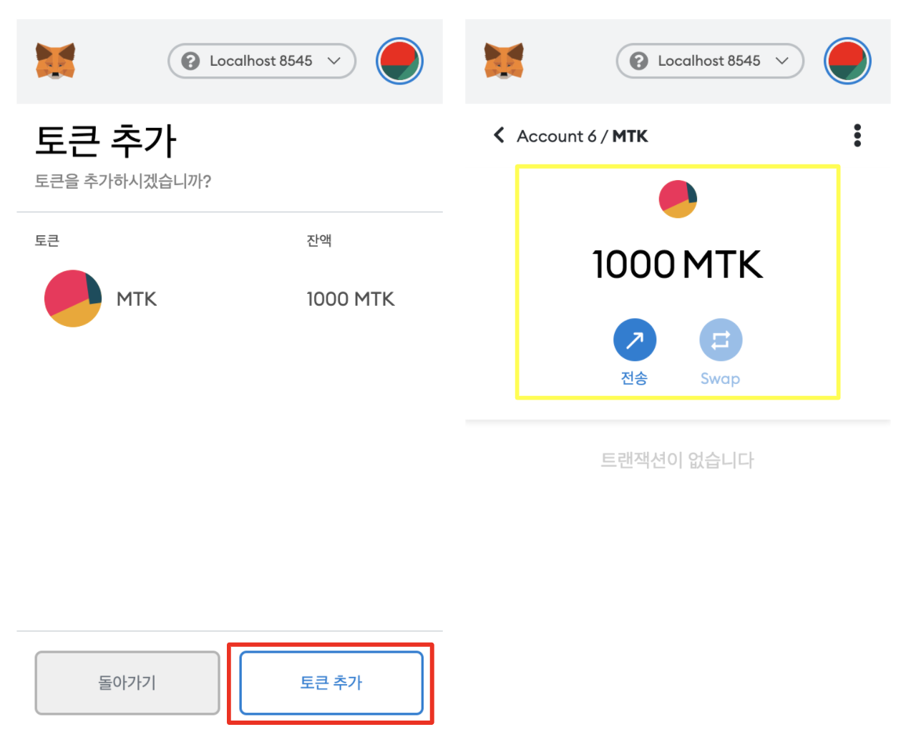

# ERC20 토큰 만들기

이번 예제에서는 ERC20 토큰을 만들어보겠습니다. 토큰은 이더와 다르게 스마트 컨트랙트 수준에서 존재합니다. 조금 더 구체적으로 말하면 스마트 컨트랙트에 저장된 숫자에 불과합니다. 그렇기 때문에 구현하는 사람에 따라 동작방식이 달라 서로 다른 토큰 간 교환이나 상호작용에 어려움이 있을 수 있습니다. 이러한 맥락 아래 ERC20 이라는 토큰의 표준이 발표되게 되었습니다. ERC20 토큰이 되기 위해서는 구현해야 할 많은 변수, 함수, 각종 이벤트들이 있지만 Openzeppelin의 ERC20 토큰 관련 스마트 컨트랙트를 상속함으로써 우리는 쉽게 토큰을 개발할 수 있습니다.


ERC20의 중추적인 데이터 구조는 두 개가 있습니다.

1.  mapping(address => uint256) balances;

    (소유자 -> 토큰 보유량) 형태로 맵핑 정보를 관리합니다. 예를 들어, (앨리스 -> 10), (밥 -> 0) 이라는 맵핑 정보가 있다면 앨리스는 10개 토큰을, 밥은 0개 토큰을 가지고 있는 것입니다. 이때 앨리스가 밥에게 5개 토큰을 송금한다면 단순히 앨리스의 맵핑 값 10에서 5를 빼고, 밥에게는 5를 더해주면 됩니다. 그러면 (앨리스 -> 5), (밥 -> 5) 로 맵핑 정보가 업데이트 되는 것입니다. 


2. mapping (address => mapping (address => uint256)) public allowed;

    두번째는 (소유자 -> (위임자 -> 송금 허용량)) 의 의미로 맵핑 정보를 가지고 있습니다. 예를 들면, (앨리스 -> (밥 -> 10)) 일 경우 밥은 앨리스의 잔고 중 10개 토큰을 제 3자에게 송금을 할 수 있습니다. 조금 더 구체적으로 알고 싶다면 ERC20을 더 찾아보시길 바랍니다.


정리하면, "프로그래밍 시각에는 토큰은 단순히 스마트 컨트랙트 상의 변수 값들이고 이는 어떠한 맵핑 정보로 관리를 한다. 그리고 표준 토큰이 존재하고 우리는 이미 다 구현되어 있는 Openzeppelin의 토큰 컨트랙트를 상속해서 쉽게 개발할 것이다" 입니다.

## MyToken
```
pragma solidity >=0.6.0;

import "@openzeppelin/contracts/token/ERC20/ERC20.sol";

contract MyToken is ERC20 {

    uint public constant INITIAL_SUPPLY = 1000 * (10 ** 18);

    constructor (string memory name, string memory symbol) ERC20(name, symbol) public {
        _mint(msg.sender, INITIAL_SUPPLY);
    }   
}
```
위 코드는 `contracts/MyToken.sol` 전부입니다. 거듭 언급했듯이 이미 만들어진 코드를 `import`하여 상속함으로써 실제 토큰 구현은 무척 간단합니다. 


생성자에는 두 가지 파라미터가 존재하는데, 하나는 토큰의 이름이고 다른 하나는 토큰의 기호입니다. 스마트 컨트랙트 컴파일 이후, 우리의 토큰의 이름과 기호를 넣어 배포를 할 예정입니다.  `_mint(msg.sender, INITIAL_SUPPLY)`는 최초에 해당 스마트 컨트랙트를 배포한 계정으로 `INITIAL_SUPPLY`만큼 토큰을 최초 발행하라는 의미입니다. 토큰 개발 끝났습니다!


## Compile
```
$ truffle compile

Compiling your contracts...
===========================
> Compiling ./contracts/MerkleTree.sol
> Compiling ./contracts/MyToken.sol
> Artifacts written to /Users/username/Workspace/basic-blockchain-programming/build/contracts
> Compiled successfully using:
   - solc: 0.6.11+commit.5ef660b1.Emscripten.clang
```


위의 명령어를 통해 코드를 컴파일 할 수 있습니다. Truffle은 *contracts* 디렉토리 아래 모든 `.sol` 파일을 컴파일 하는 것을 알 수 있습니다.


## Deploy
```
const MyToken = artifacts.require("MyToken");

module.exports = function (deployer) {
  const _name = "My Token";
  const _symbol = "MTK";
  deployer.deploy(MyToken, _name, _symbol);
};
```

위 코드는 `migrations/3_deploy_mytoken.js` 입니다. 코드를 보면 우리의 토큰 이름은 "My Token"이고, 기호는 "MTK"로 지정해 배포하는 것을 알 수 있습니다. 이제 배포를 해봅시다!

```
$ truffle migrate


Compiling your contracts...
===========================
> Compiling ./contracts/MerkleTree.sol
> Artifacts written to /Users/pleiadex/Workspace/basic-blockchain-programming/build/contracts
> Compiled successfully using:
   - solc: 0.6.11+commit.5ef660b1.Emscripten.clang


Starting migrations...
======================
> Network name:    'development'
> Network id:      1606043634322
> Block gas limit: 6721975 (0x6691b7)


1_deploy_myfirstcontract.js
===========================

   Replacing 'MyFirstContract'
   ---------------------------
   > transaction hash:    0x3489a0b9ccece519564a4107a4df0cde5e53d847a66419434255d193b6ee8a55
   > Blocks: 0            Seconds: 0
   > contract address:    0xb703f77434261eB463b714397C61280dB2C35b08
   > block number:        57
   > block timestamp:     1606149627
   > account:             0xbD79CD192ee3de491c493a35012878B4Beea3327
   > balance:             99.33652324
   > gas used:            115009 (0x1c141)
   > gas price:           20 gwei
   > value sent:          0 ETH
   > total cost:          0.00230018 ETH

   > Saving artifacts
   -------------------------------------
   > Total cost:          0.00230018 ETH


2_deploy_merkletree.js
======================

   Replacing 'MerkleTree'
   ----------------------
   > transaction hash:    0x7a8c8555b3bd202e0464f198a9140a6ecd7263ea1d1575bbe76bf452dcea00cb
   > Blocks: 0            Seconds: 0
   > contract address:    0x3e03eB29294011B4B7d37eA5cC2e636BFfC7E6f5
   > block number:        58
   > block timestamp:     1606149628
   > account:             0xbD79CD192ee3de491c493a35012878B4Beea3327
   > balance:             99.3275184
   > gas used:            450242 (0x6dec2)
   > gas price:           20 gwei
   > value sent:          0 ETH
   > total cost:          0.00900484 ETH

   > Saving artifacts
   -------------------------------------
   > Total cost:          0.00900484 ETH


3_deploy_mytoken.js
===================

   Deploying 'MyToken'
   -------------------
   > transaction hash:    0x9adf3f5dee03b0ac3c44188fb4006246784cc9a66e1aeb676c40d458ab54ad40
   > Blocks: 0            Seconds: 0
   > contract address:    0x4C41517f7f99B2a390F4bfa7a2D3Fccf38F589ed
   > block number:        59
   > block timestamp:     1606149628
   > account:             0xbD79CD192ee3de491c493a35012878B4Beea3327
   > balance:             99.30494998
   > gas used:            1128421 (0x1137e5)
   > gas price:           20 gwei
   > value sent:          0 ETH
   > total cost:          0.02256842 ETH

   > Saving artifacts
   -------------------------------------
   > Total cost:          0.02256842 ETH


Summary
=======
> Total deployments:   3
> Final cost:          0.03387344 ETH
```

⚠️ 잠깐! ⚠️
우리가 따로 기록해두어야 하는게 있습니다. 아래 두가지 값은 따로 기억해주세요!
1. Ganache-cli 에서 제공한 0번째 계정의 개인키
    기본적으로 0번째 계정으로 컨트랙트가 배포가 되기 때문에 토큰의 최초 발행량 모두 0번째 계정이 소유하고 있습니다. 아래의 경우 `0x0b30a9cdf28128a11bf568c820644de0209dea4c03b17e8c55da44cb9317b597`이 되겠습니다.
    ```
    $ ganache-cli -u 0
    Ganache CLI v6.12.0 (ganache-core: 2.13.0)

    Available Accounts
    ==================
    (0) 0xbD79CD192ee3de491c493a35012878B4Beea3327 (100 ETH)
    (1) 0x3c3754D01ED38dc8AD7E23fdE9e172f62DC122DE (100 ETH)
    (2) 0xBc1e0237228541F709b39653FF794A1cE80B9E3c (100 ETH)
    (3) 0x1316db14D45497f40644DBe7611C3267450D8838 (100 ETH)
    (4) 0x66E46C4561E49dD771E190a253c856Ae54445A94 (100 ETH)
    (5) 0x87219736Dfa004c86F77dF2D40151b4f3Ae79648 (100 ETH)
    (6) 0x9AE83EC1ae04269e2C2bc958a6177FCcE2f2350D (100 ETH)
    (7) 0xaE5e82Ba343Ae10B94652a54d29054CB8d8A0548 (100 ETH)
    (8) 0xE235622434D5469bf2D21E34fD8E7998FB3dB8F9 (100 ETH)
    (9) 0xcA209650F3755879Fb6a2e8B8d2d01D0F3CCcb38 (100 ETH)

    Private Keys
    ==================
    (0) 0x0b30a9cdf28128a11bf568c820644de0209dea4c03b17e8c55da44cb9317b597
    (1) 0xc7d8f6266f7110c61e00ce7dbbe57b70c1e29a85cf0d3565a680a874d472ad6f
    (2) 0x6f6f2eca1e73f743aa066d8ae7154b7cc1989bc0fc6368541f5d9a52f78ca9b7
    (3) 0x5d7b5a530aa12dfee80b54736b32f9508f38b77988fd169b5d241965f61b3795
    (4) 0x85e57f7e1ccfe9f49eb874eaa5e4faad180fca5b73220cf4343b0f9c27444d7f
    (5) 0x5833d16b314c64846b9c518b6f485b28c4339c5da983d6f5b186afca3642f078
    (6) 0xfc90b60e59f5176ad58d67c8191ca5da6c18b832e9814a969f048f753d689400
    (7) 0x67673627d116389e3ad1b6ee33f32573bdbba6abeb491e609cd62490e86c56b7
    (8) 0x26831a2e8c31655a25323d3075577aa0a2ef9dd6677a2ea1a473c96e178fa14d
    (9) 0x40e0a0354717c3dbad91ea4921f647d331d1ea2f4b67436379818879eafd50e9

    ...
    ```

2. 배포된 토큰 컨트랙트의 주소
    이는 위에 콘솔 로그에서 `> contract address:    0x4C41517f7f99B2a390F4bfa7a2D3Fccf38F589ed` 가 배포된 토큰의 주소입니다. 
    ```
    Deploying 'MyToken'
    -------------------
    > transaction hash:    0x9adf3f5dee03b0ac3c44188fb4006246784cc9a66e1aeb676c40d458ab54ad40
    > Blocks: 0            Seconds: 0
    > contract address:    0x4C41517f7f99B2a390F4bfa7a2D3Fccf38F589ed
    > block number:        59
    > block timestamp:     1606149628
    > account:             0xbD79CD192ee3de491c493a35012878B4Beea3327
    > balance:             99.30494998
    > gas used:            1128421 (0x1137e5)
    > gas price:           20 gwei
    > value sent:          0 ETH
    > total cost:          0.02256842 ETH

    > Saving artifacts
    -------------------------------------
    > Total cost:          0.02256842 ETH
    ```


## Test

```
contract('MyToken', () => {

    const _name = 'My Token';
    const _symbol = 'MTK';
    const _decimals = new BN(18);

    beforeEach(async function () {
        this.token = await MyToken.new(_name, _symbol); // Deploy new MyToken contract before testing.
    });

    describe('token attributes', function() {
        it('has the correct name', async function() {
            const name = await this.token.name();
            // console.log(name);
            name.should.equal(_name); // assertion; The token name should be "My Token".
        });

        it('has the correct symbol', async function() {
            const symbol = await this.token.symbol();
            // console.log(symbol);
            symbol.should.equal(_symbol); // assertion; Its symbol should be "MTK".
        });

        it('has the correct decimals', async function() {
            const decimals = await this.token.decimals();
            // console.log(decimals);
            expect(decimals).to.be.bignumber.equal(_decimals); // assertion; Its decimals should be 18.
        });
    });
});
```
위 코드는 `test/mytoken_test.js`에서 찾을 수 있습니다. 이 테스트 코드에서 수행하는 것은 먼저 테스트 전에 토큰 이름은 "My Token"이고 토큰 기호는 "MTK"로 새롭게 토큰 컨트랙트를 배포합니다. 이후 배포한 토큰 컨트랙트의 이름, 기호, Decimals(소수점단위를 의미; 일반적으로 이더 단위와 일치하기 위해 18로 설정)을 확인합니다. 토큰의 이름, 기호, Decimals이 배포 당시 인자로 넘긴 값들과 일치하면 테스트를 통과합니다.

```
$ truffle test test/mytoken_test.js
Using network 'development'.


Compiling your contracts...
===========================
> Compiling ./contracts/MerkleTree.sol
> Artifacts written to /var/folders/wj/_8d_tlzs7jl_c_qtv72j7rs40000gn/T/test--1219-3aZDwqO53XWW
> Compiled successfully using:
   - solc: 0.6.11+commit.5ef660b1.Emscripten.clang


  Contract: MyToken
    token attributes
      ✓ has the correct name
      ✓ has the correct symbol (125ms)
      ✓ has the correct decimals (94ms)


  3 passing (912ms)
```

## 메타마스크에서 토큰 확인하기

이제 실제 블록체인 지갑에서 방금 만든 토큰을 확인해봅시다.

### 메타마스크 설치하기

먼저 메타마스크를 [설치](https://chrome.google.com/webstore/detail/metamask/nkbihfbeogaeaoehlefnkodbefgpgknn?hl=ko)해주세요. 크롬 확장자 형태로 설치하시면 됩니다. 그리고 메타마스크 계정을 생성해야 하는데, [링크](https://medium.com/@mvlchain/%EB%A9%94%ED%83%80%EB%A7%88%EC%8A%A4%ED%81%AC-metamask-%EC%82%AC%EC%9A%A9%EB%B2%95-bd0f219bdc62)에서 소개하는 방법 중 1 ~ 6번까지 진행하시면 됩니다.

### 토큰 등록하기 

1. 메타마스크 로그인하기
    
    비밀번호를 입력하여 로그인합니다.

    

2. 이더리움 네트워크 변경하기
    
    Localhost 8545로 변경합니다. 
    
    [NOTE] Ganache GUI는 기본 포트 번호가 8545가 아닐 수도 있으니 Ganache의 포트 번호를 변경하거나 해당 포트 번호로 이더리움 네트워크를 변경하시면 됩니다.

    

3. 계정 가져오기

    위에서 적어둔 Ganache 0번째 계정의 개인키를 복사하여 붙여넣어줍니다. 계정을 성공적으로 가져오면 대략 99 ETH를 가진 계정를 확인할 수 있습니다. 

    

4. 토큰 추가하기

    위에서 적어둔 배포된 토큰 컨트랙트 주소를 복사하여 붙여넣어 토큰을 추가합니다. 이때 노란색 부분이 자동적으로 입력되어지는 것을 확인할 수 있는데, 이 값은 우리가 배포 시 설정한 값으로 나타날 것입니다.

    

5. 토큰 확인하기
    
    토큰이 성공적으로 추가되었으면 해당 계정은 1000 MTK을 소유할 것입니다. 이제 전송 버튼으로 다른 계정으로 우리의 토큰을 전송할 수 있습니다.

    